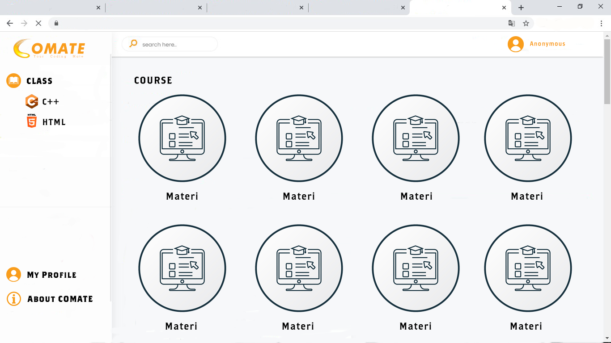
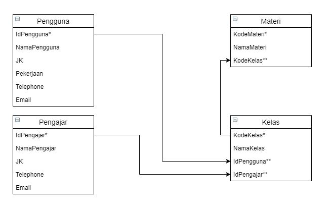
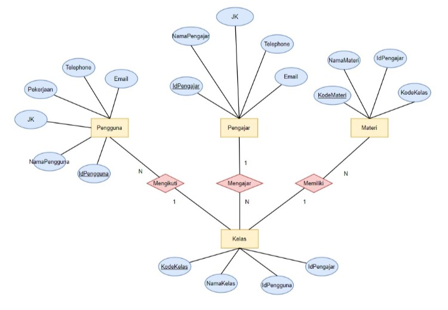

**Project COMATE**

**Fungsi :**  
- Menyediakan sarana pembelajaran untuk pengguna yang dapat diakses dimanapun dan kapanpun
- Dapat digunakan sebagai alternatif atas permasalahan dalam bidang pendidikan, baik sebagai tambahan, pelengkap, maupun pengganti atas kegiatan pembelajaran yang sudah ada.  

**Tujuan :**
- Memudahkan pengguna untuk mendapatkan referensi materi pembelajaran
- Membantu pengguna untuk mengulang dan memahami materi  

**Target Pengguna :**
- Semua kalangan  

**Mockup Kasar Sementara :**  

  

**Skema Database :**  

  
